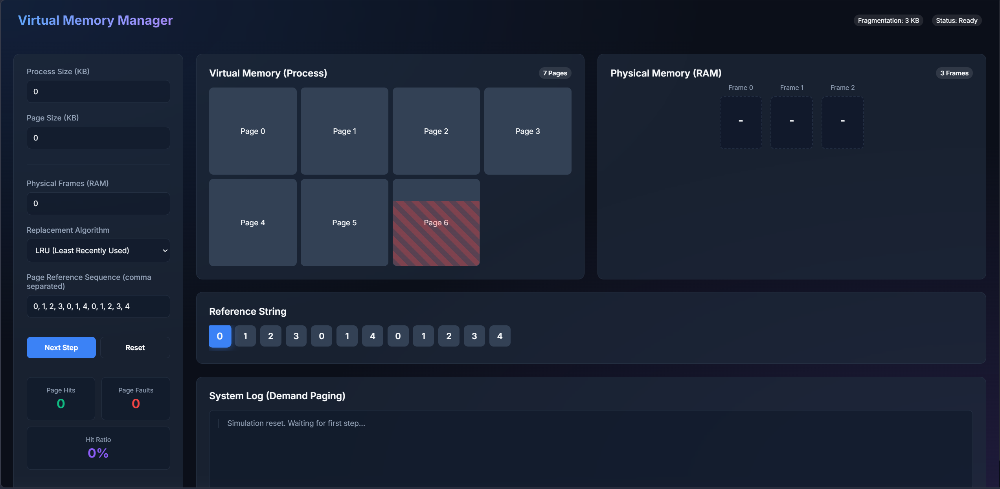
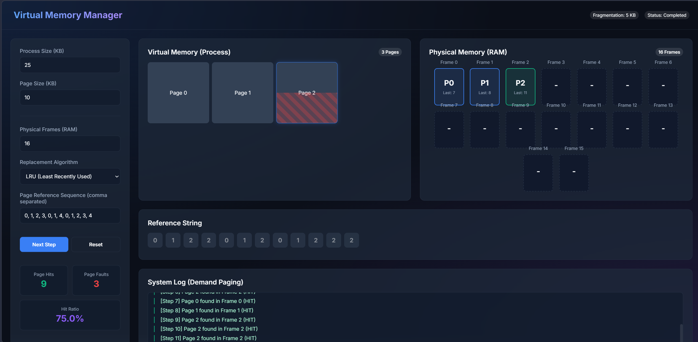

# Virtual Memory Simulator

A modern and interactive **Virtual Memory Simulator** built using HTML, CSS, and JavaScript. This project visually demonstrates how virtual memory management and page replacement algorithms work in Operating Systems.

The simulator provides a clean dashboard-style interface where users can enter page reference strings, configure memory frames, and observe page hits, page faults, and frame updates in real time.

---

## Features

* Interactive visualization of virtual memory management
* Simulate page replacement algorithms
* Real-time page hit and page fault tracking
* Dynamic frame updates and memory visualization
* Modern dark-themed UI with responsive design
* Adjustable number of frames
* Step-by-step simulation support
* Performance statistics display

---

## Supported Algorithms

### 1. FIFO (First In First Out)

Replaces the oldest page currently in memory.

### 2. LRU (Least Recently Used)

Replaces the page that has not been used for the longest time.

### 3. Optimal Page Replacement

Replaces the page that will not be used for the longest duration in the future.

---

## Technologies Used

* **HTML5** – Structure of the application
* **CSS3** – Styling and animations
* **JavaScript (Vanilla JS)** – Simulation logic and interactivity
* **Google Fonts (Inter)** – UI typography

---

## Project Structure

```bash
├── images
        └── home.png
        └── simulation.png  
├── OsfinalProject.html
├── settings.json
└── README.md
```

---

## How to Run

### Method 1: Directly Open in Browser

1. Download or clone the project.
2. Open `OsfinalProject.html` in any modern web browser.

### Method 2: Run Using VS Code Live Server

1. Open the project folder in Visual Studio Code.
2. Install the **Live Server** extension.
3. Right-click `OsfinalProject.html`.
4. Click **Open with Live Server**.

---

## Usage

1. Enter a page reference string.
2. Select a page replacement algorithm.
3. Set the number of memory frames.
4. Start the simulation.
5. Observe:

   * Page Hits
   * Page Faults
   * Memory Frame Updates
   * Algorithm Behavior

---

## Learning Objectives

This project helps students understand:

* Virtual Memory Concepts
* Demand Paging
* Page Replacement Algorithms
* Memory Management Techniques
* Operating System Fundamentals

It is especially useful for:

* Operating System Lab Projects
* Academic Demonstrations
* Viva Preparation
* OS Visualization Learning

---

## Screenshots

Add screenshots of the simulator here.






---

## Future Improvements

* Add Clock Page Replacement Algorithm
* Add Second Chance Algorithm
* Export simulation results
* Add graphs and analytics
* Mobile optimization improvements
* Add animation controls and speed adjustment
* Multi-tab simulation support

---

## Advantages of the Simulator

* Easy to understand
* Visual learning approach
* Beginner friendly
* No external dependencies required
* Fast and lightweight

---

## License

This project is for educational and academic purposes.

---

## Contributing

Contributions, suggestions, and improvements are welcome.

1. Fork the repository
2. Create a new branch
3. Commit your changes
4. Push to your branch
5. Open a Pull Request

---

## Acknowledgements

* Operating System concepts and memory management algorithms
* Academic references and OS learning resources
* Inspiration from modern dashboard UI designs
